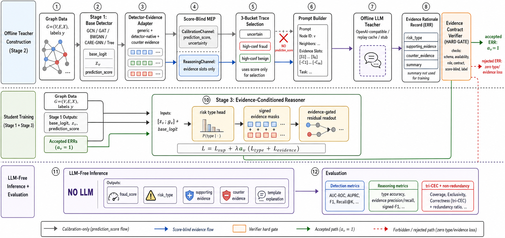

# GReaD-Core 方法讲述与框架图说明



## 1. GReaD-Core 要解决什么问题

GReaD-Core 的完整名称是 **Contract-Verified Score-Blind Evidence Distillation for LLM-Free Graph Fraud Reasoning**。它面向的核心问题是：图欺诈检测器通常可以输出一个 `fraud_score`，但很难同时输出可审查、可验证、可训练、可部署的“为什么”。

传统图欺诈检测方法大多专注于二分类或异常分数。它们可以告诉我们某个节点是否可疑，却不一定能说明它属于哪类风险、哪些证据支持该判断、哪些证据起反向抵消作用。图解释方法可以给出子图、边或特征重要性，但这些解释常常粒度偏低，难以和风控语义对齐，也难以作为稳定训练监督。LLM 可以生成自然语言理由，但如果把 LLM 直接放进图欺诈检测流程，会引入长上下文、图结构幻觉、在线推理成本、隐私和不可复现等问题。

GReaD-Core 的目标不是让 LLM 直接做图欺诈检测，而是更窄、更硬：

> 用离线 LLM 将 detector-native evidence 转成结构化 reasoning supervision，再用确定性 Evidence Contract Verifier 过滤，最后蒸馏到一个推理时完全无 LLM 的学生模型中。

一句话概括：

```text
Score-blind detector-native evidence
-> contract-verified ERR
-> evidence-conditioned residual reasoner
-> LLM-free fraud reasoning
```

## 2. 为什么已有方法没有完全解决

普通图欺诈检测器，如 GCN、GAT、BWGNN、CARE-GNN 或 tree-neighbor detector，强项是打分，不保证输出风险类型和证据角色。它们内部可能有频域响应、邻居选择、embedding disagreement 或 feature importance，但这些信号通常没有统一的 evidence interface。

普通 LLM + graph 方法会倾向于把子图、邻居、属性甚至检测分数放进 prompt，让 LLM 生成解释。这种路线有明显风险：LLM 看到 `prediction_score` 后可能只是复述 base detector 的分数，也就是 score echo，而不是生成真正有增量价值的 reasoning supervision。

普通 pseudo-label distillation 往往把 teacher 输出当作软标签或伪标签。GReaD-Core 的关键区别是：它不信任 LLM。LLM 输出必须先变成结构化 Evidence Rationale Record，且只有通过 hard verifier 的 ERR 才能进入 type/evidence 辅助损失。

普通 XAI 方法更多回答“哪些边或特征重要”。GReaD-Core 回答的是更贴近顶会审稿和风控部署的问题：

- 该节点属于哪种风险类型？
- 哪些 evidence 支持它？
- 哪些 evidence 反向抵消它？
- 如果削弱 evidence，fraud score、risk type 和 evidence mask 是否响应？
- 这些 reasoning 输出是否提供了 base score 之外的增量信息？

## 3. 核心创新点

### 3.1 Score-Blind Minimal Evidence Package

MEP 被拆成两个通道：

- `CalibrationChannel`：包含 `prediction_score` 和 `uncertainty`，只用于 calibration、trace selection 和实验分析。
- `ReasoningChannel`：包含 LLM 可见的 evidence slots，不包含 `prediction_score`。

代码中 `MinimalEvidencePackage.to_teacher_payload()` 只输出 `node_id`、`detector_name` 和 `reasoning`。这使得 LLM teacher 无法根据 base fraud score 生成理由，降低 score leakage 和 score echo 风险。

### 3.2 Detector-Evidence Adapter Protocol

GReaD-Core 不要求每个 detector 原生自带解释模块，而是使用 adapter 将不同检测器的内部信号映射到统一 evidence vocabulary。

统一 evidence 分为三类：

- generic evidence：`degree_level`、`neighbor_consistency`、`feature_neighbor_discrepancy`、`uncertainty_level`
- detector-native evidence：如 BWGNN 的频域响应、CARE-GNN 的 camouflage 信号、GCN/GAT 的 embedding-neighbor discrepancy
- counter evidence：如 benign neighbor signal 或 embedding alignment signal

这样做的意义是：GReaD-Core 不绑定某一个具体 detector，而是把“检测器内部可解释信号”转成统一、可验证、可训练的 evidence interface。

### 3.3 Offline LLM Teacher 与 Evidence Rationale Record

LLM 只在 Stage 2 离线使用。它输入 score-blind MEP，输出结构化 ERR：

```json
{
  "risk_type": "...",
  "supporting_evidence": ["..."],
  "counter_evidence": ["..."],
  "summary": "..."
}
```

其中 `summary` 只作为人类可读解释保留，不进入训练目标。训练只使用 `risk_type`、`supporting_evidence` 和 `counter_evidence`。

当前代码支持三种 LLM backend：

- `openai`：OpenAI-compatible Chat Completions API，默认模型为 `gpt-4o-mini`
- `replay`：从 cache 重放已有 LLM 输出，不联网
- `stub`：固定输出测试 ERR，用于 smoke/test

### 3.4 Evidence Contract Verifier

Evidence Contract Verifier 是 GReaD-Core 最重要的硬约束。它不是 LLM-as-judge，也不是 learned verifier，而是确定性的 hard gate。

它检查：

- schema validity
- evidence availability
- role consistency
- risk-evidence contract consistency
- score-blindness
- label compatibility

例如，`spectral_anomaly` 必须显式引用满足契约的 required evidence；`counter_signal` 不能作为 supporting evidence；`prediction_score` 不能出现在任何 supporting/counter evidence 中。

Verifier 的定位不是证明 LLM 语义绝对正确，而是证明 accepted ERR 在预定义风险 taxonomy 与 evidence contract 下是 schema-valid、evidence-closed、role-consistent、score-blind、contract-consistent 和 label-compatible 的。

### 3.5 Evidence-Conditioned Residual Student Reasoner

学生模型不是简单并行解释头。它将 base detector 的节点表征 `z_v` 与 evidence embedding `g_v` 拼接，输出：

- `base_logit`
- `final_logit`
- `type_logits`
- `pos_mask_logits`
- `neg_mask_logits`

最终 fraud logit 为：

```text
final_logit = base_logit + rho * residual_logit
```

当 `rho=0` 时，模型退化为 base detector。这既提供了清晰 ablation，也让 CEC 评价有架构基础：evidence 不是只影响解释头，也会通过 residual readout 影响最终 fraud score。

### 3.6 简洁训练目标

主训练目标是：

```text
L = L_sup + lambda * a_v * (L_type + L_evidence)
```

其中 `a_v` 是 verifier acceptance indicator。被拒绝的 ERR 对 type/evidence loss 贡献为零。`summary` 永不进入训练。

### 3.7 tri-CEC 与 non-redundancy evaluation

GReaD-Core 不只看 AUC/AUPRC，还评估 reasoning 是否有用。

tri-CEC 包括：

- Score-CEC：削弱 evidence 后 fraud score 是否变化
- Type-CEC：削弱 evidence 后 risk type 是否变化
- Evidence-CEC：削弱 evidence 后 evidence mask 是否变化

non-redundancy test 比较三层嵌套模型：

```text
Y ~ P
Y ~ P + T
Y ~ P + T + M
```

其中 `P` 是 fraud score，`T` 是 risk type，`M` 是 evidence masks。若 `P+T` 或 `P+T+M` 带来 AUC/AUPRC 增益，说明 reasoning 输出不是简单重复 base score。

## 4. 完整 Framework 数据流

### Step 1: 输入图数据

输入图为：

```text
G = (V, E, X)
```

训练节点带二分类标签：

```text
y_v in {0, 1}
```

当前实现支持 tiny、YelpChi、Amazon、tfinance、tsocial 等数据集。

### Step 2: Stage 1 训练 base detector

Stage 1 只训练基础图欺诈检测器，不使用 LLM。

检测器输出：

```text
base_logit, prediction_score, z_v
```

其中 `z_v` 是节点 embedding，`prediction_score` 是 calibration-only 信号。

### Step 3: 生成 CalibrationChannel

`prediction_score` 和 `uncertainty` 被放入 `CalibrationChannel`。

这个通道只允许用于：

- trace selection
- calibration analysis
- detection analysis

不允许进入：

- LLM teacher prompt
- supporting evidence
- counter evidence
- evidence mask target
- risk type generation payload

### Step 4: Detector adapter 抽取 Score-Blind MEP

adapter 对候选节点抽取：

- generic graph evidence
- detector-native evidence
- counter evidence

并构造：

```text
MinimalEvidencePackage = {
  node_id,
  detector_name,
  calibration,
  reasoning
}
```

传给 LLM 的 payload 只包含 reasoning channel。

### Step 5: Trace selection

Trace selection 用固定三桶选择要送给 LLM 的节点：

- uncertain
- high-confidence fraud
- high-confidence benign

桶内再做 evidence diversity sampling，使 LLM teacher 覆盖更多 evidence pattern，而不是只看分数最高或最容易的节点。

### Step 6: Stage 2 离线 LLM 生成 ERR

PromptBuilder 根据 score-blind teacher payload 生成 prompt。LLM teacher 生成 ERR。这个阶段是唯一允许调用 LLM 的阶段。

真实 API、cache replay 和 stub 都在 `src/gread_core/llm/` 下隔离，推理模块不能导入。

### Step 7: Evidence Contract Verifier

Verifier 对每个 ERR 执行硬校验：

```text
ECV(ERR, MEP, label) -> accepted / rejected
```

accepted ERR 被写入 Stage 2 artifact；rejected ERR 只记录原因，不进入 reasoning target。

### Step 8: Stage 3 训练 Evidence-Conditioned Reasoner

Stage 3 加载 Stage 1 detector checkpoint 和 Stage 2 accepted ERR。

对 accepted ERR：

- `risk_type` 转成 risk type target
- `supporting_evidence` 转成 positive evidence mask target
- `counter_evidence` 转成 negative evidence mask target
- cited evidence ids 转成 evidence token ids

然后训练 reasoner：

```text
inputs: z_v, base_logit, evidence_token_ids
outputs: final_logit, type_logits, pos_mask_logits, neg_mask_logits
loss: L_sup + lambda * a_v * (L_type + L_evidence)
```

### Step 9: LLM-free inference

推理时数据流为：

```text
Graph -> Base Detector -> Adapter -> Reasoner -> PredictionResult
```

输出：

- `fraud_score`
- `risk_type`
- `supporting_evidence`
- `counter_evidence`
- deterministic template explanation

推理阶段不调用 LLM、不导入 OpenAI/Anthropic/requests/httpx 等网络客户端。

### Step 10: Evaluation

Evaluation 分四层：

1. Detection metrics：AUC、AUPRC、F1、Precision@K、Recall@K
2. Reasoning metrics：acceptance rate、evidence F1、risk type agreement
3. tri-CEC：score/type/evidence 三维反事实响应
4. Non-redundancy：验证 reasoning 输出是否提供 base score 之外的信息

## 5. 和现有方法的准确边界

GReaD-Core 可以强主张：

- contract-consistent reasoning distillation
- score-blind teacher payload
- LLM-free inference
- detector-adaptable when native evidence exists
- counterfactually responsive evaluation

不建议过度主张：

- verifier 证明 LLM 语义真理
- causal explanation guaranteed
- universal any-detector support
- LLM rationale 是 ground truth
- tri-CEC 等同因果忠实性证明

GReaD-Core 的论文气质不是“万能解释器”，而是：**把 LLM 的不可靠自由文本压进可验证、可训练、可复现的工程契约中。**

## 6. gpt-image-2 方法图 Prompt

```text
Use case: scientific-educational
Asset type: top-tier machine learning conference paper method figure, 16:9 landscape, clean vector-style infographic.

Primary request:
Create a publication-quality method diagram for “GReaD-Core: Contract-Verified Score-Blind Evidence Distillation for LLM-Free Graph Fraud Reasoning”.

Style:
Minimal, crisp, high-contrast academic vector graphic; white background; thin dark-gray outlines; subtle color coding; no 3D, no photos, no decorative gradients, no clipart. Use conference-paper aesthetics similar to NeurIPS/ICLR/KDD/TKDE method figures. Keep typography clean and readable.

Canvas layout:
A horizontal left-to-right pipeline with three swimlanes.

Swimlane 1 title: “Offline Teacher Construction (Stage 2)”
Swimlane 2 title: “Student Training (Stage 1 + Stage 3)”
Swimlane 3 title: “LLM-Free Inference + Evaluation”

Main pipeline blocks, left to right:
1. “Graph Data G=(V,E,X), labels y”
2. “Stage 1: Base Detector”
   sublabel: “GCN / GAT / BWGNN / CARE-GNN / Tree”
   outputs: “base_logit, z_v, prediction_score”
3. “Detector-Evidence Adapter”
   sublabel: “generic + detector-native + counter evidence”
4. “Score-Blind MEP”
   show two compartments:
   - gray side compartment: “CalibrationChannel: prediction_score, uncertainty”
   - blue main compartment: “ReasoningChannel: evidence slots only”
5. “3-Bucket Trace Selection”
   small buckets: “uncertain”, “high-conf fraud”, “high-conf benign”
   note: “uses score only for selection”
6. “Prompt Builder”
   show a red crossed arrow from CalibrationChannel to Prompt Builder labeled “NO prediction_score”
7. “Offline LLM Teacher”
   sublabel: “OpenAI-compatible / replay cache / stub”
8. “Evidence Rationale Record (ERR)”
   fields: “risk_type”, “supporting_evidence”, “counter_evidence”, “summary”
   add small note: “summary not used for training”
9. “Evidence Contract Verifier”
   make this a prominent orange hard-gate block
   checks listed compactly: “schema, availability, role, contract, score-blind, label”
   output split:
   - green arrow: “accepted ERR: a_v=1”
   - red dashed arrow: “rejected ERR: zero type/evidence loss”
10. “Stage 3: Evidence-Conditioned Reasoner”
    inputs: “[z_v ; g_v] + base_logit”
    internal heads: “risk type head”, “signed evidence masks”, “evidence-gated residual readout”
    formula: “L = L_sup + λ a_v (L_type + L_evidence)”
11. “LLM-Free Inference”
    large label: “NO LLM”
    outputs: “fraud_score”, “risk_type”, “supporting evidence”, “counter evidence”, “template explanation”
12. “Evaluation”
    three grouped badges: “Detection metrics”, “Reasoning metrics”, “tri-CEC + non-redundancy”

Important visual semantics:
- Use blue for score-blind evidence flow.
- Use gray for calibration-only prediction_score flow.
- Use orange for verifier gate.
- Use green for accepted ERR path.
- Use red dashed lines for forbidden/rejected paths.
- Make the LLM block visually isolated in the offline teacher lane only.
- The inference lane must have no arrow entering from the LLM block.
- Ensure the forbidden “prediction_score -> prompt” arrow is crossed out clearly.
- Keep all text short, exact, and readable.
- No watermark, no fake logos, no extra decorative objects.

Composition:
Balanced spacing, clean arrows, clear swimlane separation, readable at paper-column scale, suitable for Figure 1 in a research paper.
```

