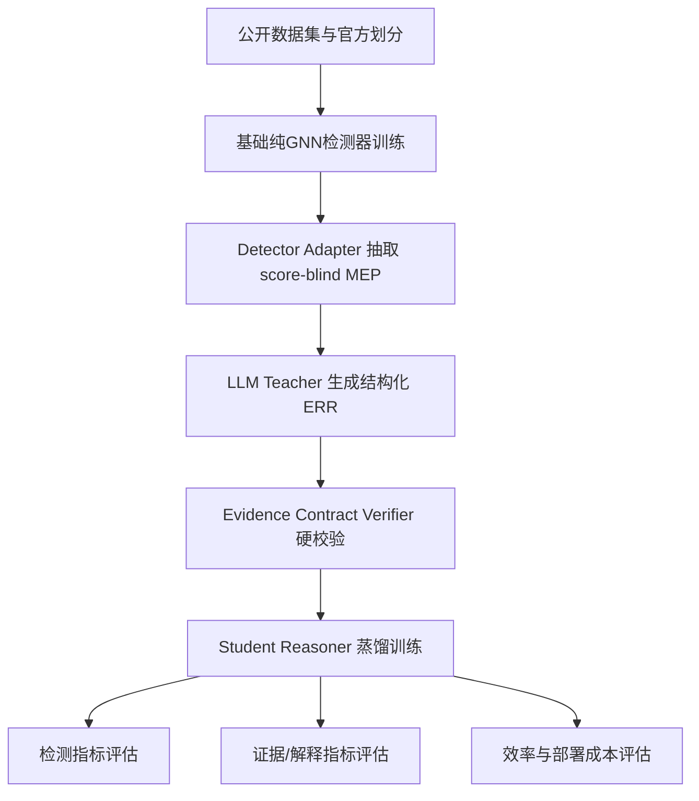

# GReaD-Core 纯GNN适配与对比实验研究报告

## 执行摘要

基于你提供的研究设定，**GReaD-Core** 的定位并不是“让 LLM 直接做图推理”，而是把一个已经训练好的图欺诈检测器，转化为能输出**欺诈分数、风险类型、有符号证据掩码、模板化解释**的轻量模型；其关键约束包括 **score-blind** 的最小证据包、**detector-native evidence** 抽取、**Evidence Contract Verifier** 的硬校验，以及最终 **LLM-free** 的 student reasoner 推理。你给出的文稿还明确强调了 detector adapter protocol，并点名了 `GCNAdapter`、`BWGNNAdapter`、`CAREGNNAdapter` 一类的适配接口，这意味着后续实验最重要的不是“罗列越多模型越好”，而是选择**能暴露中间证据、覆盖不同图分布与任务难点、且适合统一重实现**的一组纯 GNN 检测器。fileciteturn0file0

从论文说服力来看，建议把主实验组织成三层对比。第一层是**纯 GNN 检测器层**，至少覆盖同配图、异配图、多关系图、类别极不平衡图、谱异常/高频异常图五类能力轴；第二层是**强非 GNN 基线层**，尤其要加入 MLP、随机森林、XGBoost、LightGBM，以及带简单邻域聚合的树模型，因为 GADBench 的核心结论就是：**带简单邻域聚合的树集成方法，可能超过不少专门为图异常/欺诈设计的 GNN**；第三层才是**GReaD-Core 组件层**，即“同一个 detector 在是否使用 score-blind、是否使用 verifier、是否蒸馏 risk type / signed evidence mask 时”的增益分析。这样才能把“检测性能提升”和“解释/证据能力提升”同时讲清楚。citeturn23search0turn23search9turn18search0turn0search8turn14search1

在模型清单上，我建议论文主表**至少跑 12 个纯 GNN**：GCN、GraphSAGE、GAT、GIN、APPNP、SGC、H2GCN、GPR-GNN、FAGCN、R-GCN、CARE-GNN、PC-GNN、BWGNN；如果算力有限，可以把 GIN 与 R-GCN 放到“扩展实验/附录”，但 **GCN、GraphSAGE、GAT、CARE-GNN、PC-GNN、BWGNN、以及一个异配图模型（H2GCN/GPR-GNN/FAGCN）**最好保留在主表。这样既能覆盖经典基线，也能覆盖欺诈检测专用模型与异配/频谱鲁棒模型。citeturn19search0turn19search1turn37search0turn32search4turn32search1turn38search0turn38search6turn38search5turn21search6turn22search6turn11search6turn33search3turn14search1

在数据集上，建议主实验至少覆盖 **YelpChi、Amazon Fraud、T-Finance、T-Social、Elliptic、DGraphFin、ogbn-arxiv、ogbn-mag、ogbg-molhiv、ogbl-collab** 十个公开基准；其中 fraud/anomaly 节点任务负责验证主场景，OGB 的节点/图/链路任务负责验证方法并非只对某一类工业反欺诈图有效。官方基准已经为 OGB 提供统一 evaluator 和官方 split，而 Yelp/Amazon 在 DGL 中也有明确的默认 70/10/20 mask 设置。citeturn15view0turn7view3turn25view0turn24view0turn24view1turn24view2

## 研究定位与总体建议

就你的研究目标而言，**最合适的论文叙事不是“提出一个新的更强 detector”**，而是“提出一个**可插拔到多种纯 GNN detector** 上的 reasoning/distillation 框架，并在不增加在线 LLM 推理成本的前提下，同时提升检测质量、证据一致性与可部署性”。这一定义天然要求实验必须回答三个问题：  
其一，GReaD-Core 是否能普遍适配不同 detector family；  
其二，它是否只对某几个专用反欺诈模型有效；  
其三，它的收益究竟来自 teacher 蒸馏，还是来自 score leakage、模板偏置或额外参数量。fileciteturn0file0

据此，最稳妥的主实验框架应当遵循“**统一重实现 + 官方代码复核**”的原则。原因很简单：不同作者仓库的依赖差异很大，早期模型大量使用 TensorFlow 或老版本 DGL/PyTorch；例如 BWGNN 官方实现明确写明依赖 `pytorch 1.9.0` 与 `dgl 0.8.1`，而 GADBench 官方环境则推荐 `pytorch 1.13.1 + CUDA 11.7 + dgl`。如果直接拿作者仓库混跑，结论很容易被环境差异污染。更适合论文主表的做法，是用 **PyTorch + PyG/DGL** 写统一训练脚手架，主表全部用统一框架重实现；同时在附录用作者仓库复核若干关键结果，证明你的实现没有偏离原方法。citeturn32search3turn15view0turn9search9turn7view3

下面这个流程，最适合直接作为你论文“方法—实验桥接”的统一图。

这个流程与文稿中的 **Minimal Evidence Package、Evidence Contract Verifier、score-blindness、student reasoner** 设计是一致的，而且天然支持你做三类主对照：**detector-only**、**detector + naive rationale head**、**detector + GReaD-Core**。fileciteturn0file0

## 需适配的纯GNN模型清单

下表给出**建议优先适配的 13 个纯 GNN**。其中前 10 个足以满足“主文至少 10 个模型”的要求；其余几个建议一并纳入，因为它们分别补足**异配图、谱滤波、多关系图**三条证据链，能显著提升论文的说服力。表中的“适配证据点”一列，专门从 GReaD-Core 的 detector-native evidence 角度给出建议，便于你直接写入方法实现部分。fileciteturn0file0

| 模型 | 核心思想 | 更适合的场景 | 主要优点 | 主要短板 | 关键超参数与实现要点 | 适配到 GReaD-Core 的证据接口 | 论文 / 代码 |
|---|---|---|---|---|---|---|---|
| **GCN** | 用归一化邻接矩阵做一阶谱近似传播。 | 同配图、标准节点分类、最基本 detector 对照。 | 简单、稳定、审稿人熟悉、最容易做公平比较。 | 对异配图和高频异常通常偏弱，深层易过平滑。 | 层数 2–3；hidden 64/128/256；dropout 0.3–0.7；weight decay 1e-5–5e-4；保持自环与稀疏实现一致。 | 导出节点 margin、层间表示漂移、ego/neighbor discrepancy、degree-level 等通用证据。 | 论文 citeturn0search8 代码 citeturn19search0 |
| **GraphSAGE** | 邻居采样 + 聚合器学习归纳式表示。 | 大图、归纳场景、需要 neighbor sampling 的工业图。 | 可扩展、可归纳、适合大规模训练。 | 对同层高噪邻居较敏感；采样方差较大。 | fanout 可搜 `[10,10] / [15,10,5] / [25,10]`；聚合器用 mean 为主；hidden 64–256。 | 采样到的邻居分布、relation-wise sampled neighbors、一致性/不一致性比例是天然证据。 | 论文 citeturn0search9 代码 citeturn19search1 |
| **GAT** | 用邻居注意力权重替代固定归一化聚合。 | 邻居贡献差异大、希望提取可解释权重的节点任务。 | 有显式 attention，可形成较直观证据。 | 注意力不一定等于因果证据；大图成本高。 | heads 4/8；单头维度 8–32；attn dropout 0–0.6；2–3 层为主。 | attention entropy、top-k suspicious neighbors、relation attention concentration 可直接作为证据字段。 | 论文 citeturn0search10 代码 citeturn37search0 |
| **GIN** | 以 sum 聚合 + MLP 提升表达力，接近 WL 测试。 | 图分类、子结构敏感任务，也可作节点级强表达基线。 | 表达力强，适合作为 graph-level 强基线。 | 对大图节点级任务不一定最省算力；对异配图不天然鲁棒。 | MLP 深度 2–3；eps 可设 learnable；hidden 64–300；图分类时关注 pooling 一致性。 | 子结构敏感性强，适合导出 motif-like evidence 或局部结构差异信号。 | 论文 citeturn32search4 代码 citeturn32search0 |
| **APPNP** | 先预测再做 Personalized PageRank 传播。 | 长程依赖、低深度但需多步传播的节点任务。 | 传播与预测解耦，较稳，传播步数可控。 | 传播步数过大仍会带来平滑；对关系类型不敏感。 | K 取 5/10/20；α 取 0.05/0.1/0.2；前置 MLP hidden 64–256。 | PPR 传播强度、长程邻域影响、propagation-vs-MLP discrepancy 可作为证据。 | 论文 citeturn1search1 代码 citeturn32search1 |
| **SGC** | 去掉非线性并折叠权重矩阵，得到固定低通滤波 + 线性分类器。 | 轻量图基线、速度敏感实验、large-scale sanity check。 | 非常快，解释简单，适合做“下界/轻量化”对照。 | 表达能力有限；在复杂异配图或关系图上常弱。 | K 取 1–4；预计算传播并缓存；hidden 常等价为输出线性层。 | 固定低通滤波输出与原特征的差异，可作为简洁 detector-native evidence。 | 论文 citeturn38search0 代码 citeturn22search1 |
| **H2GCN** | 显式区分 ego、1-hop、2-hop，并强调异配图下的设计原则。 | 异配图、低同配图、伪装/邻居异质性明显的欺诈图。 | 是处理 heterophily 的经典强基线。 | 工程实现比 GCN/GAT 略复杂；对图构造较敏感。 | hop 常取 2；层数 2–3；保持 ego 与 higher-order channel 分开。 | ego-vs-neighbor conflict、2-hop consistency、heterophily gap 是非常好的证据字段。 | 论文 citeturn38search6 代码 citeturn38search1turn38search4 |
| **GPR-GNN** | 学习可自适应的广义 PageRank 系数，兼容同配/异配。 | 同配与异配并存、传播模式不确定的数据。 | 传播权重可学习，且具备较强通用性。 | 相比 GCN/APPNP，调参空间更大。 | K 常取 10；初始化可试 PPR / random / NPPR；hidden 64–256。 | learned propagation weights、频带偏好、topology-vs-feature reliance 很适合做证据抽取。 | 论文 citeturn38search5 代码 citeturn38search2 |
| **FAGCN** | 用 self-gating 自适应融合低频与高频信号。 | 高频异常明显、异配图、频谱信息重要的检测任务。 | 能显式处理“只看低频不够”的问题。 | 对超参和实现细节较敏感；大图上需注意效率。 | 层数 2–4；hidden 64–256；dropout 0.3–0.6；保留 gate/频率通道监控。 | 高频/低频 gate、band preference、counter-signal 与 detector-signal 对照很适合作为 MEP。 | 论文 citeturn21search6 代码 citeturn21search0 |
| **R-GCN** | 针对多关系/异构图，对不同 relation 使用不同变换并做 basis 分解。 | 异构图、多关系图、保留原始 relation 结构的欺诈图。 | 关系语义明确，适合异构基准如 ogbn-mag。 | 参数量大；relation 多时需 basis/block 分解。 | num_bases 4–30；relation dropout 0–0.5；保持原始 relation 类型，不要静默同质化。 | relation-wise contribution、basis coefficient、relation-specific anomaly signal 可以直接进入证据包。 | 论文 citeturn2search2 代码/教程 citeturn22search6turn20search11 |
| **CARE-GNN** | 通过 relation-aware neighbor selector 对抗 camouflaged fraudsters。 | 伪装邻居、关系噪声、多关系欺诈检测。 | 针对欺诈图非常有代表性；与你课题高度贴合。 | 训练更复杂；实现依赖 relation-level 设计。 | 每关系采样邻居 8–64；优先从作者默认值起搜；保持 relation-specific selector。 | 被选中/被拒绝邻居、relation-level suspiciousness、counter evidence 与 uncertainty 很适合 GReaD-Core。 | 论文 citeturn11search6 代码 citeturn33search5turn33search2 |
| **PC-GNN** | 通过 Pick + Choose + Aggregate 解决类不平衡与困难邻居选择。 | 极度不平衡的欺诈节点分类。 | 是类别不平衡图欺诈检测的重要强基线。 | 对采样与损失权重较敏感；实现复杂度高于 CARE-GNN。 | label-balanced sampler、neighbor selector、under-sample ratio、batch size 都要搜；建议以作者默认配置为中心。 | 采样平衡率、被选邻居分布、少数类邻居覆盖率，可自然转成结构化证据。 | 论文 citeturn33search3 代码 citeturn33search0 |
| **BWGNN** | 用 Beta wavelet 构造带通滤波器，捕捉异常导致的高频右移。 | 图异常/欺诈检测，尤其是频谱异常显著的数据。 | 是 anomaly/fraud 谱方法里极强且极有说服力的基线。 | 与通用 GNN 的实现习惯不同；对频谱解释要写清楚。 | 滤波阶数/通道数、hidden 64–256；保留 band-pass 响应与层间频谱统计。 | high-frequency response、band activation、right-shift score 非常适配 score-blind evidence。 | 论文 citeturn14search1 代码 citeturn32search3 |

**建议写法**：论文正文主表建议至少包含 **GCN、GraphSAGE、GAT、APPNP、H2GCN、GPR-GNN、CARE-GNN、PC-GNN、BWGNN** 九个；若篇幅允许，再把 **GIN、SGC、FAGCN、R-GCN** 放进同一主表。这样一张表即可同时覆盖**经典基线、轻量基线、异配图基线、多关系基线、欺诈专用基线、频谱异常基线**。citeturn19search0turn19search1turn37search0turn32search1turn38search1turn38search2turn33search5turn33search0turn32search3

## 对比方法与公开基准数据集

为了让论文结论更有说服力，建议把基线分成两类：**检测基线**与**解释/证据控制基线**。前者回答“你的 detector adaptation 有没有提高检测性能”；后者回答“你的证据链是否真实、是否不是模板幻觉”。尤其是检测基线中，**树模型 + 简单邻域聚合**不能省，因为这恰好是近年图异常检测 benchmark 的重要发现。citeturn23search0turn23search9

| 基线类别 | 方法 | 建议输入 | 论文中的角色 | 推荐理由 | 参考来源 |
|---|---|---|---|---|---|
| 非图基线 | **MLP** | 原始节点特征 | 最弱但必要的 feature-only 对照 | 证明拓扑信息是否真的带来增益。 | citeturn28search0 |
| 非图基线 | **随机森林** | 原始特征 / 邻域聚合特征 | 强 tabular baseline | 在不平衡数据上通常很稳。 | citeturn27search9turn23search9 |
| 非图基线 | **XGBoost** | 原始特征 / 邻域聚合特征 | 强 tabular baseline | 工业界接受度高，且在 GADBench 中很强。 | citeturn27search0turn23search9 |
| 非图基线 | **LightGBM / CatBoost** | 原始特征 / 聚合特征 | 补足 GBDT 家族 | 有助于排除“只是换了更强树模型”的质疑。 | citeturn27search3turn28search1 |
| 浅层图表征 | **DeepWalk + LR/MLP** | 结构嵌入 + 分类器 | 经典图 embedding baseline | 验证 message passing 是否必要。 | citeturn28search2 |
| 浅层图表征 | **node2vec + XGBoost/MLP** | 结构嵌入 + 分类器 | 更强的浅层结构基线 | 对结构模式的覆盖优于 DeepWalk。 | citeturn29search0turn29search4 |
| 图任务强基线 | **RF-Graph / XGB-Graph** | 原始特征 + 简单邻域聚合统计 | 论文必须纳入 | GADBench 显示这类方法可能强于不少 GNN。 | citeturn23search9turn23search0 |
| 解释控制 | **GNNExplainer** | 训练后 detector | 后验解释对照 | 对比“后验解释”与“蒸馏式证据推理”的差别。 | citeturn29search2turn29search10 |
| 解释控制 | **PGExplainer** | 训练后 detector | 参数化解释器对照 | 对比可泛化 explainer 与 GReaD-Core 的差别。 | citeturn29search3 |
| 方法控制 | **Detector only** | 基检测器输出 | 最基础对照 | 测 GReaD-Core 纯增益。 | fileciteturn0file0 |
| 方法控制 | **Detector + naive rationale head** | 不做 contract verification | 关键消融 | 检验证据约束是否真正有效。 | fileciteturn0file0 |
| 方法控制 | **Detector + teacher visible score** | 去掉 score-blind | 关键反证实验 | 用来证明收益不是 label leakage。 | fileciteturn0file0 |

下面的数据集组合，足以覆盖**节点分类、图分类、链路预测、异构图、动态图**五类任务，也覆盖了你的主场景——图欺诈/异常检测。

| 数据集 | 任务类型 | 图类型 | 规模 | 官方指标 | 论文中建议主指标 | 为什么要放进主实验 | 官方/下载 |
|---|---|---|---|---|---|---|---|
| **YelpChi** | 欺诈节点分类 | 多关系静态图 | 45,954 节点，3,846,979 边，32 维特征，异常占比约 14.5% | 常见为 AUC / AP | **AUPRC 主报，ROC-AUC、F1 补充** | 经典 opinion fraud 基准，CARE/PC-GNN 直接使用。 | citeturn15view0turn7view3 |
| **Amazon Fraud** | 欺诈节点分类 | 多关系静态图 | 11,944 节点，4,398,392 边，25 维特征，异常占比约 9.5% | 常见为 AUC / AP | **AUPRC 主报，ROC-AUC、F1 补充** | 与 YelpChi 组成最经典的 fraud pair。 | citeturn15view0turn11search5turn7view3 |
| **T-Finance** | 异常节点分类 | 交易图 | 39,357 节点，21,222,543 边，10 维特征，异常占比约 4.6% | 常见为 AUC / AP | **AUPRC、ROC-AUC、Recall@FPR≤1%** | BWGNN 官方核心数据集之一，频谱异常非常关键。 | citeturn15view0turn32search3 |
| **T-Social** | 异常节点分类 | 社交图 | 5,781,065 节点，73,105,508 边，10 维特征，异常占比约 3.0% | 常见为 AUC / AP | **AUPRC、ROC-AUC、效率指标** | 大规模压力测试，能验证方法的可扩展性。 | citeturn15view0turn32search3 |
| **Elliptic** | 动态反洗钱节点分类 | 时间交易图 | 203,769 交易节点，234,355 有向边，166 维特征，49 个时间步 | AML 文献常报 F1/AUC | **时间切分下的 AUPRC、ROC-AUC、F1** | 真实 AML 时序图，适合验证 time-aware split。 | citeturn35search5turn35search1 |
| **DGraphFin** | 金融异常节点分类 | 动态金融图 | 3,700,550 节点，4,300,999 动态边，17 维特征，异常占比约 1.3% | 竞赛/文献多报 AUC | **AUPRC 主报，ROC-AUC、Recall@Top-K 补充** | 极大规模、强不平衡，工业说服力很强。 | citeturn15view0turn6search7turn6search11 |
| **ogbn-arxiv** | 节点分类 | 同质引文图 | 169,343 节点，1,166,243 边，40 类 | Accuracy | **Accuracy 主报，Macro-F1 补充** | 通用节点分类 sanity check，验证方法不只对欺诈图有效。 | citeturn25view0 |
| **ogbn-mag** | 异构节点分类 | 异构学术图 | 1,939,743 节点，21,111,007 边；含 paper/author/institution/field 四类实体 | Accuracy | **Accuracy 主报** | 支撑 R-GCN/hetero 适配的必要性。 | citeturn24view2 |
| **ogbg-molhiv** | 图分类 | 分子图集合 | 41,127 个图，每图平均 25.5 节点、27.5 边 | ROC-AUC | **ROC-AUC** | 用于证明 student reasoner 的 graph-level 泛化性，GIN 很适合。 | citeturn24view0 |
| **ogbl-collab** | 链路预测 | 时间合作图 | 235,868 节点，1,285,465 边 | Hits@50 | **Hits@50 主报，MRR 补充** | 验证方法在时间切分的 link prediction 上是否稳定。 | citeturn24view1 |

如果主论文篇幅有限，建议把 **YelpChi、Amazon、T-Finance、DGraphFin、ogbn-mag、ogbg-molhiv、ogbl-collab** 作为主表核心数据集，Elliptic 和 T-Social 放附录或扩展实验。但如果你的投稿方向偏**反欺诈/异常检测**，那么 **Elliptic 与 DGraphFin** 最好保留在主文中，因为它们直接对应动态 AML / 金融风控场景。citeturn35search5turn15view0turn6search7

## 实验设计与对比框架

实验设计上，最重要的原则是**统一预算、统一 split、统一随机种子、统一早停规则**。GNN 评测中的经典问题之一，就是给不同模型使用不同超参预算、沿用单一固定 split，最后导致模型排名不稳甚至反转。针对这一点，建议把所有 detector 放在**同一训练协议**内。citeturn18search0

**训练/验证/测试划分建议如下。**  
对于 OGB 数据集，**严格使用官方 split 与官方 evaluator**；这是最容易被审稿人接受的做法。对于 YelpChi / Amazon，若使用 DGL 内置 FraudDataset，则采用其默认 **70% train / 10% val / 20% test** 掩码，并固定 `random_seed=717` 作为复现实验之一；同时建议再补充 5 个随机划分，验证结果不是 mask 偶然性。对于动态数据如 Elliptic、DGraphFin，必须使用**时间顺序切分**，禁止随机打散时间步。对于 ogbl-collab，要遵守官方时间切分与 evaluator 规则，并明确说明是否允许在推理时使用验证边。citeturn7view3turn25view0turn24view1turn9search5

**超参数搜索策略建议如下。**  
小中型数据集上，对每个模型—数据集对进行 **30–50 次随机搜索**；大规模数据集上可降为 **15–20 次**，但必须保证每个模型相同预算。GADBench 官方仓库给出了默认 benchmark 与 random search 两套脚本，甚至示例了 100 trial 的随机搜索，这非常适合拿来作为“统一预算”的文献依据。若算力允许，你可以采用“作者默认参数为中心点 + 随机搜索”的方式：先用官方配置复现，再进行公平调参。citeturn15view0turn18search0

**直接可写进论文的统一搜索空间**可按下列方式设置：学习率 `{1e-4, 3e-4, 1e-3, 3e-3, 1e-2}`；weight decay `{0, 1e-6, 1e-5, 1e-4, 5e-4}`；hidden dim `{32, 64, 128, 256}`；dropout `{0, 0.2, 0.5, 0.7}`；层数一般 `{2, 3, 4}`。模型专属超参建议补搜：GAT 的 `heads`，APPNP 的 `K, α`，SGC 的 `K`，GraphSAGE 的 `fanout`，R-GCN 的 `num_bases`，PC-GNN 的采样/选择参数，BWGNN 的带通滤波阶数或通道数。为保证公平，**所有模型的最佳 checkpoint 一律由验证集官方指标选择**，而不是由测试集调参。其中国内/工业风控论文最容易被质疑的点，恰恰就是这条。citeturn32search1turn38search0turn33search3turn32search3

**重复次数与统计检验**建议写得更硬一些。小中型数据集建议 **10 个随机种子**；大图数据集至少 **5 个随机种子**。单数据集内，你可以对“GReaD-Core vs. 最强基线”做**双侧 Wilcoxon signed-rank test**；同时报告 **Cliff’s delta** 作为效应量。跨多个数据集比较建议使用 **Friedman test + Nemenyi/CD diagram**，或 Friedman 后配合 Holm 校正的成对比较。Demsar 的结论非常明确：在多个数据集上比较多个分类器时，非参数检验比朴素 t-test 更安全，也更适合配 Critical Difference 图。citeturn18search10turn34search1turn34search7turn34search8

**建议纳入的消融实验清单**如下，这部分最能体现 GReaD-Core 的“方法可信性”：

| 消融项 | 实验设置 | 预期回答的问题 |
|---|---|---|
| `w/o score-blind` | 让 teacher 看见 detector score | 收益是否来自 label leakage / score echo。 |
| `w/o contract verifier` | 不做硬校验直接蒸馏 | verifier 是否真正提升证据一致性。 |
| `w/o detector-native evidence` | 只保留 generic graph stats | detector-specific signals 是否必要。 |
| `w/o signed evidence mask` | 不预测支持/反证掩码 | 结构化证据信号是否贡献性能或解释质量。 |
| `w/o risk type head` | 只预测 fraud score | 多任务蒸馏是否带来帮助。 |
| `teacher-only rationale` | 用 teacher 输出直接解释、不训练 student | student 蒸馏的部署价值与一致性收益。 |
| `post-hoc explainer control` | 用 GNNExplainer / PGExplainer 替代 | 你的方法和后验解释器到底差在哪里。 |
| `generic detector family swap` | GCN / GAT / CARE / BWGNN 逐一套用 | 方法是否 truly detector-agnostic。 |

以上消融项与文稿中的 **score-blindness、contract verification、signed evidence mask、risk type、detector adapter** 结构是一一对应的，因此非常适合直接写入方法和实验章节。fileciteturn0file0

**算力估计**建议分层写。  
小中型数据集（YelpChi、Amazon、ogbn-arxiv、ogbg-molhiv、ogbl-collab）用 **1 张 24–48GB GPU** 即可完成统一训练。中大型异构/金融数据（ogbn-mag、DGraphFin）建议使用 **1–2 张 40GB/80GB GPU** 与邻居采样。若要一次性跑“多模型 × 多数据集 × 10 seeds”的完整 anomaly benchmark，GADBench 官方 README 直接提醒：跑 25 个模型在 10 个数据集上的 fully-supervised benchmark，**需要超过 48GB 显存的 Nvidia GPU**。这条非常适合写进“计算资源”小节。citeturn15view0turn24view2turn6search11

## 评价指标与可视化方案

指标上，建议你把**阈值无关指标**作为主指标，把**阈值有关指标**作为部署导向的补充指标。对于不平衡欺诈/异常检测任务，推荐正文主表优先报告 **AUPRC（或 AP）**，同时报告 **ROC-AUC**；原因是 Precision–Recall 曲线在不平衡数据上通常比 ROC 曲线更有信息量，而 `average_precision_score` 的定义与 PR 曲线面积并不完全等价，scikit-learn 文档也明确提醒了这一点。citeturn30search1turn30search0turn30search2

建议使用下面这套“任务—指标”映射：

| 任务 | 主指标 | 次指标 | 阈值策略 | 推荐图表 |
|---|---|---|---|---|
| 欺诈/异常节点分类 | **AUPRC** | ROC-AUC、Macro-F1、Recall@FPR≤1%、Precision@K | 阈值只在验证集确定；测试集冻结 | PR 曲线、ROC 曲线、Top-K 命中曲线 |
| 普通节点分类 | **Accuracy** | Macro-F1、ECE | 默认阈值或 argmax | 柱状图 + 误差线 |
| 图分类 | **ROC-AUC** 或 Accuracy | AP、ECE | 验证集选阈值 | Leaderboard 表 + violin plot |
| 链路预测 | **Hits@K / MRR** | AUC、AP（若自定义负采样） | 按官方 evaluator | 排名条形图、MRR 箱线图 |
| 证据/解释质量 | **Contract pass rate**、Risk-type Macro-F1 | Faithfulness、Sufficiency、Comprehensiveness、Sparsity、Latency | 不依赖固定阈值 | 热力图、散点图、案例图 |

对你的课题来说，除了检测指标，还应加入**证据一致性指标**。最建议的四项是：  
**Contract Pass Rate**，衡量生成/蒸馏出的证据是否通过 schema 与 role consistency 校验；  
**Risk Type Macro-F1**，衡量风险类别监督是否真正学到；  
**Sufficiency / Comprehensiveness**，分别看“只保留证据”与“删掉证据”对预测的影响；  
**Latency / Throughput**，衡量 LLM-free 推理阶段的部署价值。前两项直接对应你文稿中的 contract-verifier 与 risk type 输出，后两项则与 GNNExplainer / PGExplainer 一类解释器的常见 faithfulness 分析相呼应。fileciteturn0file0turn29search10turn29search3

在可视化上，我建议主文最多放六类图，已经足够完整，而且每一种图都有明确功能，不会显得“堆图”：

| 图表类型 | 用途 | 是否建议进主文 |
|---|---|---|
| **总结果表格**：`mean ± std`，最好值加粗 | 主结果 | 必须 |
| **Critical Difference Diagram** | 跨数据集整体排名显著性 | 强烈建议 |
| **PR/ROC 曲线** | 不平衡 fraud 数据集的 operating behavior | 强烈建议 |
| **Violin / Box plot** | 展示不同 seeds 下稳定性 | 建议 |
| **消融热力图** | 展示 score-blind / verifier / evidence heads 的相对贡献 | 必须 |
| **案例级证据图** | 展示 risk type、support/counter evidence mask、模板解释 | 必须 |

其中，**Critical Difference Diagram** 对“多个模型、多个数据集”论文非常加分，因为它不只报均值，还显式表达统计显著性。Demsar 的论文与后续实现文档都把它作为推荐可视化。citeturn18search10turn34search7

## 实现与复现注意事项

你这篇论文最大的复现风险，不在模型本身，而在**数据预处理和环境一致性**。最先要写清楚的是：**所有模型是否共用同一份图构造、特征标准化、mask、负采样、阈值与 early stopping 规则**。如果这些细节不统一，后面所有比较都会被认为“不公平”。这恰是 GNN 评测文献反复指出的问题。citeturn18search0

需要特别注意的点有以下几类。  
首先，**YelpChi 特征版本问题**要写清楚。部分 PC-GNN 相关实现说明里提到，YelpChi 曾出现过旧版 100 维特征和新版 32 维特征两套配置；若你主文和附录没写清楚，很容易导致他人无法复现数值。其次，DGL FraudDataset 文档明确写明 Yelp/Amazon 是**双向图且无自连接**，因此不同库里是否额外加 self-loop 必须统一声明。再次，Elliptic 中大量节点是未知标签，必须说明它们是只参与 message passing，还是也进入半监督损失设计。最后，ogbl-collab 是否在推理时引入验证边，也必须遵守官方规则且对所有方法一致。citeturn33search1turn7view3turn35search5turn9search5

我非常建议在实现章节明确区分两套环境：  
一套是**统一重实现环境**，用于论文主表；  
另一套是**官方代码复核环境**，用于附录复现实验。  
统一重实现环境建议以 **PyTorch 为中心**，同质图与 OGB 优先用 **PyG/OGB loader**，多关系/异构图优先用 **DGL heterograph** 或 PyG 的 HeteroData；官方代码只用于抽查。PyG 和 DGL 官方文档都已经提供了大量标准化组件，而 OGB 提供了统一 dataloader 和 evaluator，这会显著降低实验工程噪声。citeturn9search9turn8search13turn7view3turn20search11

效率优化上，建议你把“**缓存传播**”和“**采样训练**”写成论文里清楚的工程策略。像 APPNP、SGC 这类传播可以预计算并缓存；GraphSAGE、R-GCN、DGraphFin/ogbn-mag 这类大图，应使用邻居采样；混合精度和梯度累积只在保证所有模型同预算时再启用；对大图必须固定 batch construction 逻辑，避免某些方法额外看到更多邻居。对于 fraud 任务，建议把**预测阈值**严格绑定在验证集上，比如固定“验证集 F1 最优阈值”或“验证集 precision ≥ 0.90 时的最大 recall 阈值”，测试集只做一次评估，不要重复调参。citeturn32search1turn38search0turn24view2turn6search11

最后，GReaD-Core 特有的复现要点必须单独写出来：  
一是 **teacher payload 必须严格剥离 calibration channel**，否则 score-blind 假设失效；  
二是 **allowed_support_ids / allowed_counter_ids** 要作为数据工件落盘，便于 contract-verifier 复核；  
三是 **student 输出的 risk type、evidence mask、template explanation** 必须和 detector 原始分数分离保存，避免后处理把 detector score 重新泄漏进解释模板。否则你这篇论文最核心的创新点会被审稿人直接击中。fileciteturn0file0

## 开放问题与局限

这份报告优先围绕你提供的 **GReaD-Core detector-adaptation 设定** 与**官方论文/代码**整理，因此没有把近两年的 Graph Transformer、graph foundation model、LLM-augmented GNN 一并纳入主比较；原因不是它们不重要，而是它们会把论文叙事从“**纯 GNN detector 适配**”带偏到“更大模型是否更强”的方向。对于你当前这篇论文，这反而会稀释核心贡献。fileciteturn0file0

另一个局限是：部分动态与异构 benchmark 的**官方推荐 split 细节**在不同仓库/论文里并不完全统一。为避免引入不确定性，我在主表里优先选择了**官方 split 明确**或**至少官方 evaluator 明确**的数据集；对 Elliptic、DGraphFin 一类数据，建议你在正式实验前再把时间切分规则写进仓库的 `DATA_PROTOCOL.md`，并在论文中逐字说明。citeturn35search1turn6search7turn25view0turn24view1

总体上，如果你要追求**最有说服力**的主文版本，我的建议是：  
**一张 13 个纯 GNN 的 detector 主表 + 一张强非 GNN 基线表 + 一张 GReaD-Core 消融表 + 一张多数据集 CD 图 + 两张 PR/案例图**。  
按这个结构组织，论文的“公平性、完整性、可复现性、部署价值”四条证据链会是闭合的。citeturn23search0turn18search10turn34search7turn0file0